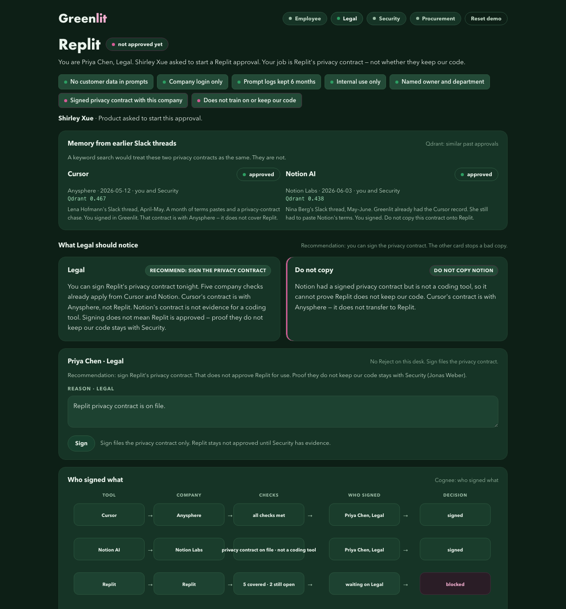

# Greenlit

**Every signed AI-tool approval makes the next one faster.**

Cognee × Qdrant hack night — Berlin, 14 August 2026.

Teams start over every time someone asks for a new AI tool, because the last privacy contract is buried in Slack. Greenlit turns that Slack request into a signed record the next request can reuse: company checks that still apply are already covered; only what is new about this company stays open.

> The chatbot can recommend. It cannot approve.

## The question

```
@Greenlit I want to use Replit for internal prototypes. Can you help with the approval?
```

## Search finds Cursor and Notion. It cannot tell what still applies.

This is the third request. Cursor already got a yes (a month of Slack, then saved). Notion already got a yes (days, not a month — people still pasted terms). Tonight is Replit.

Searching Slack for “privacy contract” or “approval” finds those two yeses. They look like the answer. They are not: a past yes is not reusable just because the words match. Cursor’s contract is with a different company. Notion is not a coding tool, so it cannot prove Replit will not keep our code.



Qdrant finds similar past approvals (Cursor 0.467, Notion 0.438). Cognee remembers who signed what for which company. Legal can file Replit’s privacy contract. That does not copy Notion’s, and it does not approve Replit for use. A person has to sign. There is no search box.

## Stack

| Layer | Role |
|---|---|
| Slack | Where people talk (optional live bot) |
| Qdrant | Finds similar past approvals |
| Cognee | Remembers who signed what for which company |
| Qwen | Drafts Legal and Security notes |
| Code | Writes the official record. Not the chatbot. |
| Web sign-off | A person has to sign |

## Run locally

Needs Python 3.12, Docker, and an OpenAI-compatible Qwen key (chat + embeddings). Embedding batch size must stay `10`.

```bash
docker run -d --name qdrant -p 6333:6333 qdrant/qdrant
cp .env.example .env   # fill LLM_API_KEY and EMBEDDING_API_KEY
python3 -m venv .venv && source .venv/bin/activate
pip install -r requirements.txt
python ingest.py
python retrieve.py "Replit internal prototypes"   # Cursor should rank above Notion
python serve.py                                   # http://127.0.0.1:8765/
```

Import `cognee_community_vector_adapter_qdrant.register` as a **module** (side-effect registration). Do not call `register()`. Do not use the default LanceDB backend.

Open http://127.0.0.1:8765/?role=Legal — Sign files only the privacy contract. `POST /demo/reset` between takes. Optional: http://127.0.0.1:8765/history.html — Cursor’s month in Slack, then Notion.

Optional Slack: fill `SLACK_BOT_TOKEN`, `SLACK_SIGNING_SECRET`, and `SLACK_APP_TOKEN` in `.env`, then `python slack_bot.py`. Mention the bot with the Replit sentence above.

`python smoke.py` checks chat, embeddings, Qdrant, and a small Cognee round-trip.

## Honest scope

Greenlit helps run an approval. It does not certify that a company is legally compliant. The people who must sign stay responsible.
